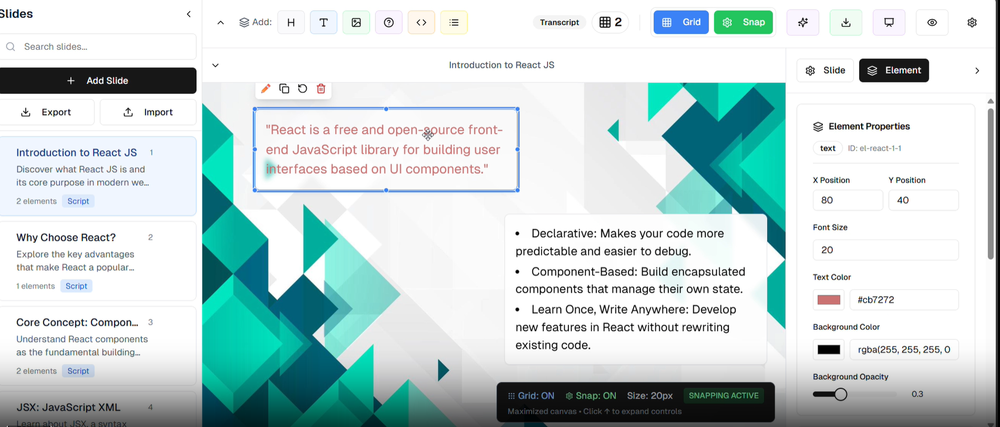
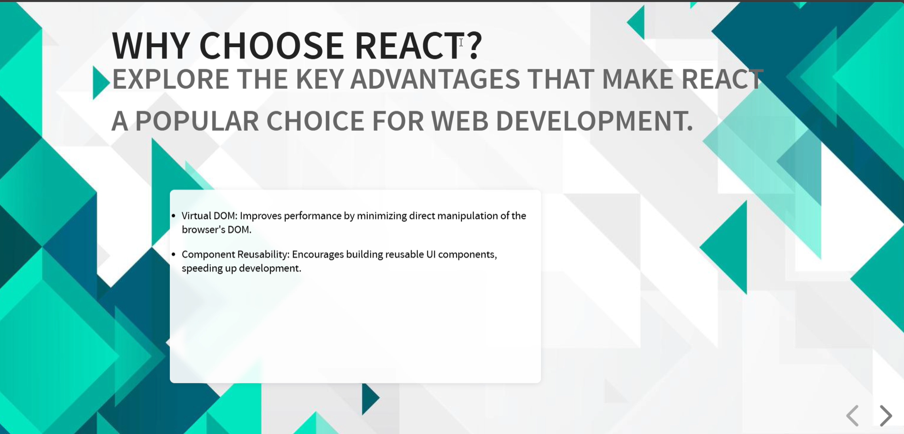
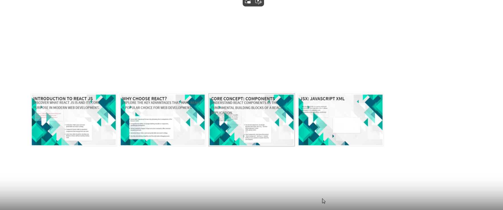

# 📊 Slides-AI

A powerful, modern, and collaborative **slide editor and presenter** built using **Next.js**. This app allows users to create, edit, and present beautiful, responsive presentations with ease.

Video URL : https://drive.google.com/file/d/13oECvXXW0NEdJfFbgLcYf6Jp6sahQbiw/view?usp=sharing

---

## 🚀 Features

- 🖱️ Drag & drop slide editor
- ✏️ Rich text editing and formatting
- 🧩 Slide elements (text, images, shapes, etc.)
- 🧭 Slide navigation and preview panel
- 📤 Export Reveal JS or Json Format
- 🧠 AI create the slide for you.
- 🤖 AI Enhancement: Advanced AI customization for improved slide suggestions.
- 🎬 Animation: Preview and edit mode available for dynamic presentations.

---

## Video

[]

---

## Image







---

## ⚙️ Tech Stack

        **Next.js
	TypeScript
	Shadcn
	Radix UI
	Vercel-ai
	Reveal-JS**

## 🧠 AI Integration

To enable AI-powered slide generation, create a `.env` file in the root of the project with your chosen provider's API key. You can select from one of the following options:

- Google Generative AI:
  ```env
  GOOGLE_GENERATIVE_AI_API_KEY=your-gemini-api-key
  ```
- OpenAI:
  ```env
  OPENAI_API_KEY=your-openai-api-key
  ```
- Anthropic Claude:
  ```env
  CLAUDE_API_KEY=your-claude-api-key
  ```

Make sure to replace the placeholder text with your actual API keys.

---

## 🔧 Improvements

- [ ] Optimise Reveal.js code for accurate visualization of editor content.
- [ ] Add dark mode to the presentation.
- [ ] Improve the prompt for better clarity.
- [ ] Make the editor smoother for enhanced user experience.

---

## 📂 Project Structure

Below is a simplified overview of the project structure:

```
├── app/
│   ├── globals.css
│   ├── layout.tsx
│   └── page.tsx
├── api/
│   ├── enhance-content/
│   │   └── route.ts
│   ├── generate-quiz/
│   │   └── route.ts
│   └── generate-slides/
│       └── route.ts
├── components/
│   ├── ai-assistant-panel.tsx
│   ├── ai-settings-dialog.tsx
│   ├── drag-drop-canvas.tsx
│   ├── export-dialog.tsx
│   ├── grapesjs-canvas.tsx
│   ├── interactive-quiz.tsx
│   ├── playback-controls.tsx
│   ├── presentation-preview.tsx
│   ├── reveal-export-dialog.tsx
│   ├── slide-canvas.tsx
│   ├── slide-editor.tsx
│   ├── slide-menu.tsx
│   ├── slide-properties-panel.tsx
│   ├── theme-provider.tsx
│   ├── toolbar.tsx
│   └── ui/
│       └── ... (various UI components)
├── contexts/
│   └── grid-context.tsx
├── hooks/
│   └── ... (custom hooks)
├── lib/
│   └── utils.ts
├── public/
│   └── ... (assets & images)
├── styles/
│   └── globals.css
└── types/
    └── slide-types.ts
```

---

## 📦 Installation

Clone the repository and install dependencies using your preferred package manager (PNPM or NPM):

```bash
# Using PNPM
pnpm install

# Or using NPM
npm install
```

You can then run the development server:

```bash
# Using PNPM
pnpm run dev

# Or using NPM
npm run dev
```

---

Enjoy creating impactful presentations with Slides-AI!
